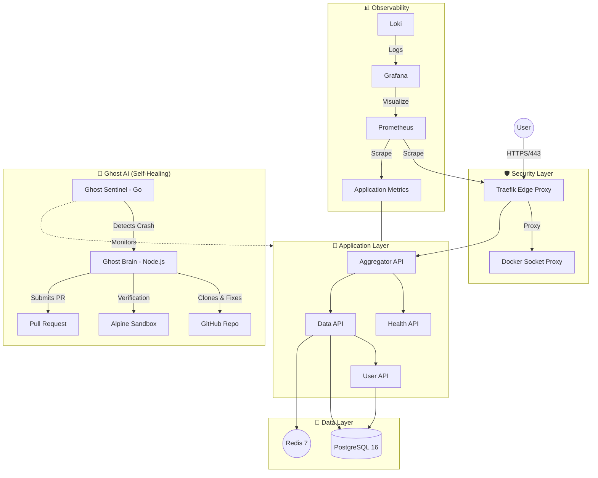
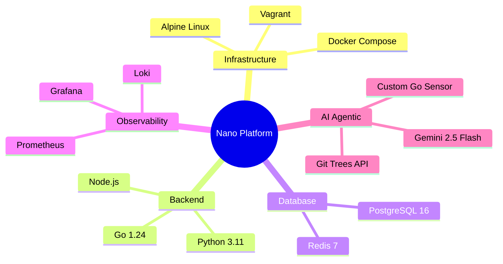

# Nano DevOps Platform with Ghost Engineer 👻

Welcome to the **Nano DevOps Platform**, a production-grade infrastructure designed to orchestrate a complete microservices ecosystem and a full observability stack within a strict **6GB RAM** constraint.

## 🧠 The Engineering Philosophy

In modern DevOps, "more resources" is often the default answer to performance issues. This project takes the opposite path: **Efficiency by Design**. We've engineered a platform that mimics a massive distributed system but is optimized for cost-effective single-node deployments.

### 1. Architectural Efficiency: Why Alpine Linux?
To run multiple APIs and a full monitoring suite on 6GB RAM, every megabyte counts.
- **The Choice:** We chose **Alpine Linux** as our base OS and container runtime.
- **The Impact:** By utilizing `musl libc` and `busybox`, we reduced the OS footprint to <100MB, leaving 98% of the resources for the application layer.
- **Kernel Tuning:** Through [sysctl_tuning.sh](project_devops/platform/infra/scripts/system/sysctl_tuning.sh), we optimized TCP stack buffers and file descriptors to handle high-concurrency API traffic.

### 2. Security-First Infrastructure
Security is baked into the provisioning phase.
- **Docker Socket Isolation:** We implemented a **Socket Proxy Layer** ([docker-compose.yml](project_devops/platform/composition/docker-compose.yml)), which acts as a read-only firewall for Docker API calls.
- **SSH Hardening:** A **Zero-Password Policy** is enforced. Access is strictly managed via ED25519 SSH keys.

### 3. GitOps & Resiliency: Blue-Green Rollbacks
Our deployment strategy focuses on **Mean Time to Recovery (MTTR)**.
- **Automated Rollbacks:** Deployment scripts perform a blue-green style health validation. If the new version fails its 60-second health check, the system triggers an **instant rollback**.

---

## 🏗 System Architecture



## 🛠 Tech Stack Matrix



---

## 🚀 The Ghost Engineer: Autonomous Self-Healing 👻

This platform features an integrated AI Dev Agent ecosystem that haunts your infrastructure to find and fix bugs automatically.

### 1. **Production: The Silent Sentinel (Agent-Node)**
- **Role**: A "Watchdog" process written in **Go** for an ultra-low footprint (<20MB RAM).
- **Function**: Monitors Docker events and logs. It only **Detects -> Packages Context -> Reports** to the Brain.

### 2. **Platform: The Ghost Workshop (AI-Agent)**
- **Role**: A private "Laboratory" reasoning engine (Node.js).
- **Function**: 
  - **Reasoning**: LLM-driven analysis of incident logs (Gemini 2.5 Flash).
  - **Sandbox Factory**: Spawns ephemeral Alpine containers to clone code, fix bugs, and verify patches.
  - **Verification**: Automatically detects project stacks (Node, Python, Java, PHP) and runs tests.
  - **PR Submission**: Submits atomic commits via Git Trees API and opens a Pull Request for human review.

---

##  Quick Start

```bash
vagrant up      # Provision the entire infrastructure
vagrant ssh     # Access the control plane
./cli.sh up     # Launch all 15+ services
```

*For detailed operations, see the [User Guide](PLATFORM_USER_GUIDE.md).*
