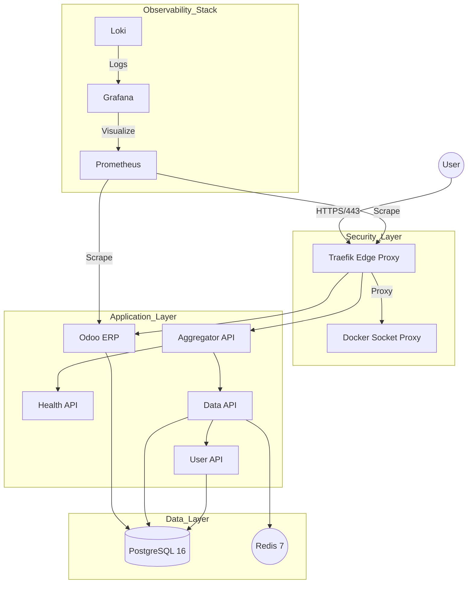

# Nano DevOps Platform: Engineering a High-Performance, Secure Single-Node Cluster

Welcome to the **Nano DevOps Platform**, a production-grade infrastructure designed to orchestrate 15+ services (Odoo ERP, Python Microservices, and a full Observability stack) within a strict **6GB RAM** constraint.

## 🧠 The Engineering Philosophy

In modern DevOps, "more resources" is often the default answer to performance issues. This project takes the opposite path: **Efficiency by Design**. We've engineered a platform that mimics a massive distributed system but is optimized for edge computing or cost-effective single-node deployments.

### 1. Architectural Efficiency: Why Alpine Linux?
To run a heavy ERP like Odoo alongside a full monitoring suite on 6GB RAM, every megabyte counts.
- **The Choice:** We chose **Alpine Linux** as our base OS and container runtime.
- **The Impact:** By utilizing `musl libc` and `busybox`, we reduced the OS footprint to <100MB, leaving 98% of the resources for the application layer.
- **Kernel Tuning:** Through [sysctl_tuning.sh](project_devops/platform/infra/scripts/system/sysctl_tuning.sh), we optimized TCP stack buffers and file descriptors to handle high-concurrency API traffic without the overhead of a standard generic kernel.

### 2. Security-First Infrastructure
Security is not an afterthought; it's baked into the provisioning phase.
- **Docker Socket Isolation:** Standard Traefik setups often expose `/var/run/docker.sock` directly to the internet-facing container. We implemented a **Socket Proxy Layer** ([docker-compose.yml](project_devops/platform/composition/docker-compose.yml)), which acts as a read-only firewall for Docker API calls.
- **SSH Hardening:** We've enforced a **Zero-Password Policy**. Access is strictly managed via ED25519 SSH keys with automated account unlocking and `sshd` hardening during the [user_ssh_setup.sh](project_devops/platform/infra/scripts/system/user_ssh_setup.sh) phase.

### 3. GitOps & Resiliency: The Safety Net
Our deployment strategy focuses on **Mean Time to Recovery (MTTR)**.
- **Automated Rollbacks:** The [deploy.sh](project_devops/platform/ops/deployment/deploy.sh) script doesn't just "restart" containers. It performs a blue-green style health validation. If the new version fails its 60-second health check, the system triggers an **instant rollback** to the last known stable state defined in `.deployment-history`.

---

## 🏗 System Architecture



---

## 🚀 Quick Start

```bash
vagrant up      # Provision the entire infrastructure
vagrant ssh     # Access the control plane
./cli.sh up     # Launch all 15+ services
```

*For detailed operations, see the [User Guide](PLATFORM_USER_GUIDE.md).*
