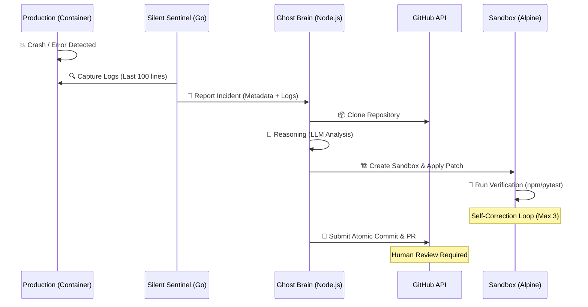
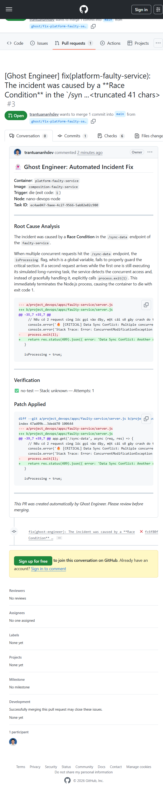
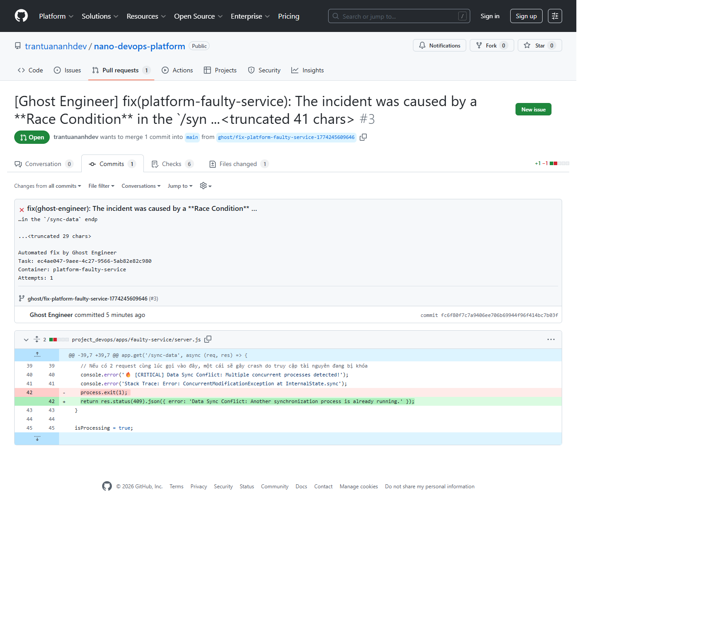

# Ghost AI: Autonomous Self-Healing Ecosystem 👻

> **"Traditional DevOps alerts you when things break. Ghost AI fixes them before you even wake up."**

Ghost AI (The Ghost Engineer) is a production-grade, resource-efficient, and fully autonomous AI Agentic ecosystem designed to haunt your infrastructure—detecting, analyzing, and patching software defects in real-time. It bridges the gap between observability and remediation by transforming incident logs directly into verified Pull Requests.

---

## 🧠 The "AI-Native Engineer" Philosophy

This project is built by an **AI-Native Engineer with a strong DevOps background**. Instead of just "using AI" for code completion, this ecosystem treats AI as a **first-class citizen in the infrastructure**, integrated directly into the Linux kernel tuning, Docker socket monitoring, and GitOps delivery pipeline.

---

## 🏗 Multi-Agent Architecture: Eyes & Brain

Ghost AI is architected with a strict separation of concerns, utilizing a **Multi-Agent orchestration** to ensure maximum performance and zero interference with production traffic.

### 1. **The Silent Sentinel (agent-node)**
- **Technology**: Written in **Go** (Zero-dependency, Native Docker Socket interaction).
- **Footprint**: Ultra-low (**<20MB RAM**).
- **Role**: The "Eyes" of the infrastructure.
- **Context Handling**: It doesn't just watch; it **captures the state**. It extracts the final 100 lines of log context, container metadata, and environment snapshots to package into a high-density report for the Brain.

### 2. **The Ghost Workshop (ai-agent)**
- **Technology**: **Node.js** reasoning engine.
- **Role**: The central "Brain" and Laboratory.
- **Memory & State Management**: 
  - **Persistent Memory**: Uses **PostgreSQL** to maintain a long-term task state and incident history.
  - **Ephemeral State**: Spawns isolated **Alpine containers** for each task, ensuring a clean-room environment for cloning and testing.
- **Self-Correction Loop**: If a patch fails its tests, the AI reads the compiler/test errors and recursively attempts to fix its own patch (up to 3 times).

---

## 🛠 End-to-End Autonomous Workflow



---

## � Advanced Agentic Capabilities

Unlike simple Copilots, Ghost AI demonstrates true **Agentic behavior**:

- **Context Injection**: It doesn't just read the logs; it **injects source code context**. It intelligently identifies the most relevant files (e.g., `server.js`, `app.py`) and includes them in the LLM's reasoning window to provide the "Big Picture."
- **Autonomous Tool-Use**: The Brain doesn't just suggest text; it **operates tools**. It executes `git`, `docker`, `patch`, and `npm/pytest` within the sandbox to verify its own work.
- **Recursive Self-Correction**: It possesses a feedback loop, allowing it to learn from its own mistakes during the verification phase. If a test fails, the error output is fed back into the next iteration's prompt.
- **Stack Agnostic**: Built-in support for Node.js (npm/yarn/pnpm), Python (pip/poetry), Java (Maven/Gradle), and PHP (Composer).

---

## 🔌 DevOps & Infrastructure Synergy

- **Resource Efficient**: Designed to run a full microservices stack + observability + AI on just 6GB RAM—optimized via **Alpine Linux**, **Go binary stripping**, and **Node.js memory limits**.
- **Non-Intrusive & Secure**: Operates via a **Read-Only Docker Socket Proxy**, ensuring the AI can see the world without being able to destroy it.
- **GitOps Delivery**: Instead of hot-patching production, it integrates with professional developer workflows by submitting Pull Requests for human review.

---

## � Project Structure

- [agent-node/](file:///c:/TA-work/nano-project-devops/project_devops/apps/ai-powered-development/agent-node): Go-based monitoring sensor.
- [ai-agent/](file:///c:/TA-work/nano-project-devops/project_devops/apps/ai-powered-development/ai-agent): Node.js-based AI reasoning workshop.
- [guide-ai-agent/](file:///c:/TA-work/nano-project-devops/project_devops/apps/ai-powered-development/guide-ai-agent): System design documentation and "6 Layers of AI Engineering".
- [faulty-service/](file:///c:/TA-work/nano-project-devops/project_devops/apps/ai-powered-development/faulty-service): Demo target with intentional bugs (Race Condition, Memory Leak) for the AI to fix.

---
*Developed by the Ghost Engineer Team - Haunting your bugs away.* 👻

## 📺 Demo & Validation

### **Real-world Output Example**

Below are actual screenshots of Ghost AI detecting an incident, analyzing the root cause, and submitting a verified Pull Request.

#### **1. Automated Incident Fix (PR Summary)**
AI identifies the race condition, explains the RCA, and details the applied patch.


#### **2. Verified Code Patch (Diff View)**
The precise fix replacing a hard crash with graceful error handling.


To see Ghost AI in action within this lab environment:

1. **Trigger an Incident**: 
   ```bash
   # Attack the faulty-service to trigger a Race Condition crash
   curl -s http://faulty.nano.platform/sync-data & sleep 0.5 && curl -s http://faulty.nano.platform/sync-data
   ```
2. **Watch the Agent Work**:
   ```bash
   # Follow the AI Agent logs to see Detection -> Analysis -> Patching
   ./cli.sh ai-logs
   ```
3. **Verify the Fix**:
   Check your GitHub repository for a new Pull Request containing the automated fix and test results.


