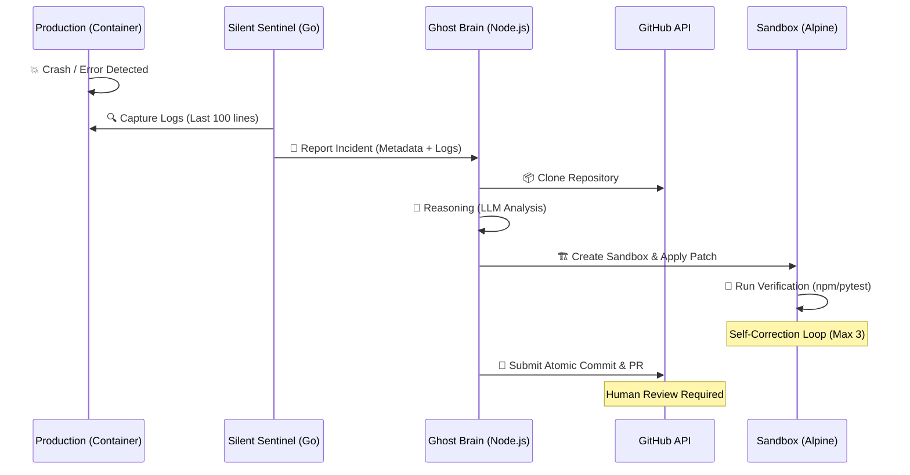
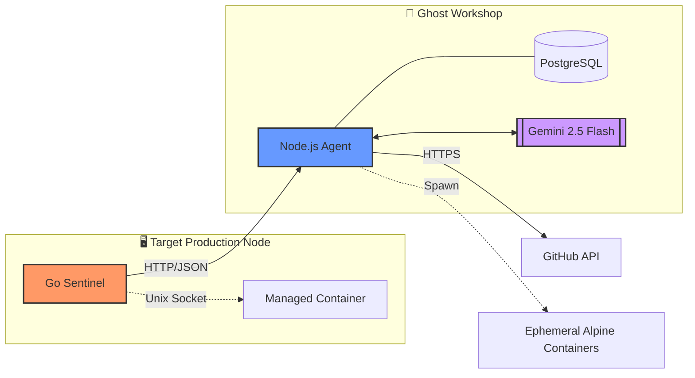

# Ghost AI: Autonomous Self-Healing Ecosystem 👻

> **"Traditional DevOps alerts you when things break. Ghost AI fixes them before you even wake up."**

Ghost AI (The Ghost Engineer) is a production-grade, resource-efficient, and fully autonomous AI Agentic ecosystem designed to haunt your infrastructure—detecting, analyzing, and patching software defects in real-time. It bridges the gap between observability and remediation by transforming incident logs directly into verified Pull Requests.

---

## 🧠 Architectural Philosophy: Eyes & Brain

Ghost AI is architected with a strict separation of concerns to ensure maximum performance on restricted hardware (6GB RAM) and zero interference with production traffic.

### 1. **The Silent Sentinel (agent-node)**
- **Technology**: Written in **Go** (Zero-dependency, Native Docker Socket interaction).
- **Footprint**: Ultra-low (**<20MB RAM**).
- **Role**: The "Eyes" of the infrastructure.
- **Workflow**:
  - Monitors Docker Events (die, oom, crash) via Unix Sockets.
  - Captures the final 100 lines of log context before container failure.
  - **Zero Reasoning Policy**: To protect production stability, no AI reasoning happens here. It only **Detects -> Packages Context -> Reports** to the Workshop.

### 2. **The Ghost Workshop (ai-agent)**
- **Technology**: **Node.js** reasoning engine.
- **Role**: The central "Brain" and Laboratory.
- **Workflow**:
  - **Root Cause Analysis (RCA)**: Uses LLMs (Gemini 2.5 Flash) to analyze the discrepancy between logs and source code.
  - **Ephemeral Sandbox**: Spawns isolated Alpine containers to clone the repository and verify patches.
  - **Self-Correction Loop**: If a patch fails its tests, the AI reads the compiler/test errors and attempts to fix its own patch (up to 3 times).

---

## 🛠 End-to-End Autonomous Workflow

## 🔌 System Connectivity & Tech Stack

## ⚡ Stack Agnostic Capabilities

- **Stack Agnostic**: Built-in support for Node.js (npm/yarn/pnpm), Python (pip/poetry), Java (Maven/Gradle), and PHP (Composer).
- **Resource Efficient**: Designed to run a full microservices stack + observability + AI on just 6GB RAM.
- **Non-Intrusive**: Does not run on developer machines. It only appears when there is a real production problem or a PR needs verification.
- **Human-in-the-Loop**: Admin reviews the AI's fix and clicks "Approve" to trigger deployment via CI/CD.

---

## 🚀 Why is this "True Agentic AI"?

Ghost AI moves beyond simple code assistance (Copilot) into the realm of **Agentic Engineering**:
- **Autonomy**: It makes high-level decisions from the moment of failure to the final PR submission.
- **Tool Proficiency**: It doesn't just suggest code; it uses Git, Docker, and Test Runners as tools.
- **Recursive Self-Correction**: It possesses a feedback loop, allowing it to learn from its own mistakes during the verification phase.

---
*Developed by the Ghost Engineer Team - Haunting your bugs away.* 👻
