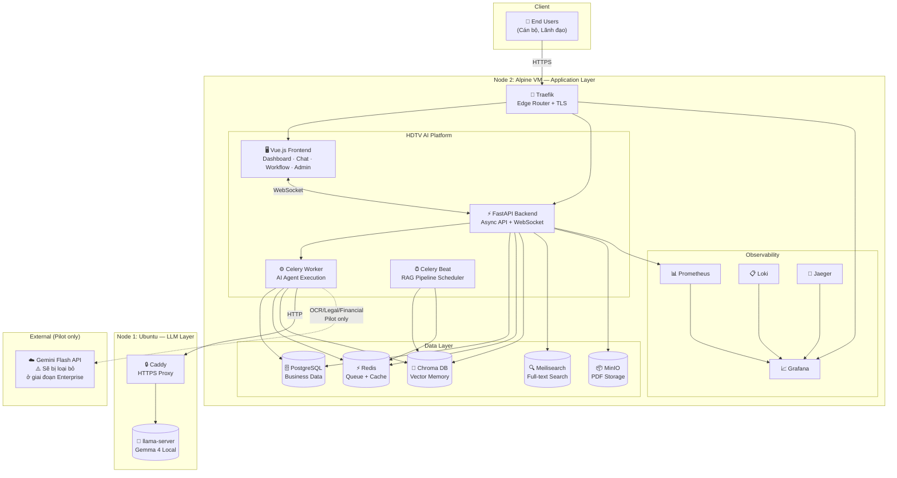

# Platform at a Glance

> **Audience:** CEO, CTO
> **Format:** 1 trang tổng quan — biểu đồ + số liệu chính

---

## Full System Diagram



---

## Key Numbers

| Metric | Value |
|--------|-------|
| **Total RAM used** | ~2.45 GB (trên VM 6GB) |
| **API endpoints** | 40+ (tất cả verified) |
| **AI Agent level** | Level 4 (Plan→Execute→Reflect→Critic) |
| **Tool integrations** | 7 tools (ERP, Legal, OCR, DOffice, PMIS, Sandbox) |
| **LLM backends** | 2 (local Gemma 4 + Gemini Flash) |
| **Observability** | Prometheus + Grafana + Loki + Jaeger + 14 alerts |
| **Deploy time** | `vagrant up` → demo ready ~10 phút |
| **DB migrations** | 12 migrations (001→012), all applied |
| **FE views** | 14 views fully wired to API |
| **Test coverage** | test.sh (bash) + 13 pytest static cases |

---

## Tech Stack tóm tắt

```
Frontend:   Vue 3 + Pinia + Vite + Tailwind
Backend:    FastAPI (Python 3.12, async)
Workers:    Celery + Redis
Databases:  PostgreSQL + Redis + Chroma + Meilisearch + MinIO
LLM:        llama-server (Gemma 4) + Gemini Flash API
Infra:      Docker Compose + Traefik + Vagrant (VMware)
CI/CD:      GitHub Actions
Automation: Ansible (Ubuntu LLM node)
Monitoring: Prometheus + Grafana + Loki + Jaeger + Alertmanager
```
