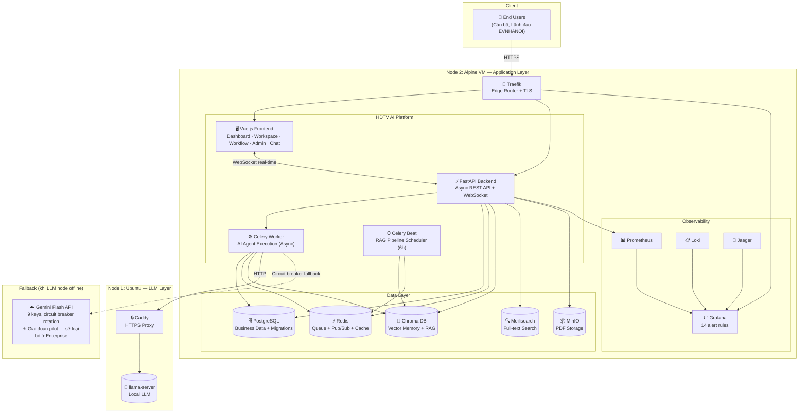

# Platform at a Glance

> **Audience:** CEO, CTO
> **Format:** 1 trang tổng quan — biểu đồ + số liệu chính
> **Cập nhật:** 2026-06-13

---

## Full System Diagram



---

## Key Numbers

| Metric | Value | Ghi chú |
|--------|-------|---------|
| **Total RAM used** | ~2.45 GB (VM 6GB) | 50% headroom cho peak load |
| **API endpoints** | 40+ (tất cả verified) | REST + WebSocket |
| **AI Agent level** | Level 4 | Plan → Execute → Reflect → Critic |
| **Tool integrations** | 7 tools | ERP, Legal, OCR, DOffice, PMIS, Sandbox, Budget |
| **LLM backends** | 2 | Local llama-server + Gemini Flash fallback |
| **Observability** | 4 systems + 14 alerts | Prometheus + Grafana + Loki + Jaeger |
| **Deploy time** | ~5 phút | `COPY_PROJECT_DEVOPS=1 vagrant up` → fully automated |
| **DB migrations** | 18 (001→018, all applied) | Alembic, zero manual SQL |
| **FE views** | 14 views | Tất cả wired to real API |
| **Seed data** | Thật từ 4 tờ trình EVN | 8 users + 16 dossiers + BPMN + alerts |
| **Demo login** | admin@evnhanoi.vn | Password: EVN@2024! |

---

## Tech Stack

```
Frontend:    Vue 3 + Pinia + Vue Router + Vite
Backend:     FastAPI (Python 3.11, full async)
Workers:     Celery 5 + Redis pub/sub
Databases:   PostgreSQL 15 + Redis + Chroma + Meilisearch + MinIO
LLM:         llama-server (local, any GGUF model) + Gemini Flash fallback
AI Agent:    Multi-role ReAct: Planner / Executor / Reflector / Critic
Memory:      Short-term (PG) + Long-term (Chroma) + Feedback lessons
Infra:       Docker Compose + Nginx + Vagrant (VMware/VirtualBox)
CI/CD:       GitHub Actions → GHCR (immutable images)
Automation:  Ansible (Ubuntu LLM node)
Monitoring:  Prometheus + Grafana + Loki + Jaeger + Alertmanager
Security:    JWT auth + bcrypt + non-root containers + resource limits
```

---

## Workflow nghiệp vụ EVNHANOI (hồ sơ UAV mẫu)

```
Tờ trình 07/KT           198/TTr-EVNHANOI        Phiếu trình HĐTV
(Ban Kỹ thuật)    →      (TGĐ ký, trình HĐTV) → (Đỗ Tuấn Anh ký)
       │                        │                        │
       │              AI Thẩm định (30-60s)              │
       │         ┌──────────────────────────┐            │
       │         │ LegalGraphRAG      ✅    │            │
       │         │ TechnicalStandCheck ⚠️   │            │
       │         │ ProcurementCheck    ⚠️   │            │
       │         │ Critic → approved=True  │            │
       │         └──────────────────────────┘            │
       │                        │                        │
       └────────────────────────┴────────────────────────┘
                    2 kiến nghị hiệu chỉnh
          (khớp chính xác Báo cáo thẩm tra Ban TH thật)
```
