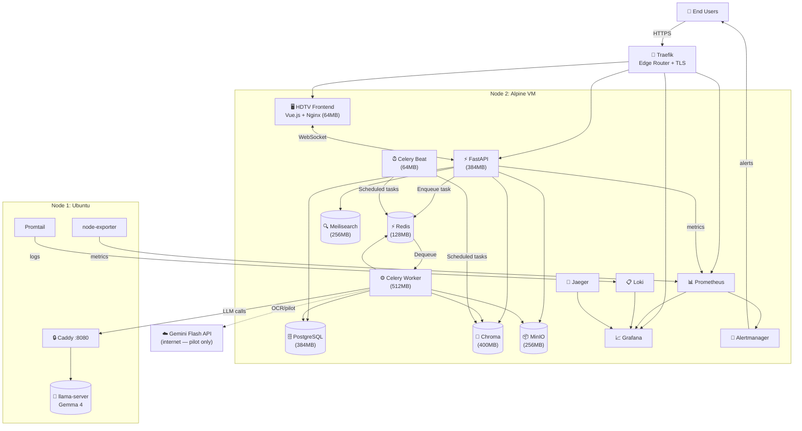

# Full Platform Diagram — Nano DevOps Platform

> **Audience:** CTO
> **Mục đích:** Bức tranh toàn bộ hệ thống — 2 nodes, tất cả services, tất cả flows.

---

## Tổng quan 2-Node Topology

```
┌──────────────────────────────────────────────────────────────────┐
│  NODE 1: Ubuntu (LLM Inference Server)                           │
│  Hardware: Laptop/Workstation với RAM ≥ 8GB                      │
│  Role: ONLY LLM — không chạy bất kỳ app service nào khác        │
│                                                                  │
│  ┌─────────────────────────────────────────┐                     │
│  │  llama-server (Gemma 4 via llama.cpp)   │  Port: 8081 (local) │
│  │  RAM: ~4-6GB                            │                     │
│  └─────────────────────────────────────────┘                     │
│  ┌──────────────────────┐  ┌──────────────────────────────────┐  │
│  │  Caddy               │  │  Observability agents            │  │
│  │  :8080 → :8081 HTTPS │  │  node-exporter :9100             │  │
│  │  TLS termination      │  │  Promtail → Loki (Alpine)        │  │
│  └──────────────────────┘  └──────────────────────────────────┘  │
└──────────────────────────────────────────────────────────────────┘
                          ↕ HTTPS :8080
                    (internal network only)
┌──────────────────────────────────────────────────────────────────┐
│  NODE 2: Alpine Linux VM (Application Server)                    │
│  Hardware: VMware Vagrant VM, 6GB RAM                            │
│  Role: Everything except LLM                                     │
│                                                                  │
│  ┌─────────────────────────────────────────────────────────┐     │
│  │  EDGE LAYER                                             │     │
│  │  Traefik :80/:443 — Reverse proxy, TLS, service routing │     │
│  └─────────────────────────────────────────────────────────┘     │
│                              ↓                                   │
│  ┌────────────────────────────────────────────────────────────┐  │
│  │  APPLICATION LAYER                                         │  │
│  │  ┌──────────────┐  ┌───────────────────┐  ┌────────────┐  │  │
│  │  │  HDTV        │  │  Celery Worker    │  │  Celery    │  │  │
│  │  │  Frontend    │  │  (AI Agent runs   │  │  Beat      │  │  │
│  │  │  Vue.js/Nginx│  │   here, 512MB)    │  │  Scheduler │  │  │
│  │  │  64MB        │  │                   │  │  64MB      │  │  │
│  │  └──────────────┘  └───────────────────┘  └────────────┘  │  │
│  │  ┌──────────────────────────────────────────────────────┐  │  │
│  │  │  FastAPI Backend (384MB)                             │  │  │
│  │  │  Async REST API + WebSocket                          │  │  │
│  │  │  Port: 8000                                          │  │  │
│  │  └──────────────────────────────────────────────────────┘  │  │
│  └────────────────────────────────────────────────────────────┘  │
│                              ↓                                   │
│  ┌────────────────────────────────────────────────────────────┐  │
│  │  DATA LAYER                                                │  │
│  │  ┌──────────┐  ┌──────────┐  ┌──────────┐  ┌──────────┐  │  │
│  │  │Postgres  │  │  Redis   │  │  Chroma  │  │Meilisearch│  │  │
│  │  │  384MB   │  │  128MB   │  │  400MB   │  │  256MB   │  │  │
│  │  └──────────┘  └──────────┘  └──────────┘  └──────────┘  │  │
│  │  ┌──────────────────────────────────────────────────────┐  │  │
│  │  │  MinIO (Object Storage) — 256MB                      │  │  │
│  │  └──────────────────────────────────────────────────────┘  │  │
│  └────────────────────────────────────────────────────────────┘  │
│                              ↓                                   │
│  ┌────────────────────────────────────────────────────────────┐  │
│  │  OBSERVABILITY LAYER                                       │  │
│  │  Prometheus → Grafana    Loki (logs)    Jaeger (traces)    │  │
│  │  Alertmanager → alerts to users                            │  │
│  └────────────────────────────────────────────────────────────┘  │
└──────────────────────────────────────────────────────────────────┘
```

---

## Full Mermaid Architecture Diagram



---

## RAM Budget

| Service | Limit | Actual |
|---------|-------|--------|
| hdtv-postgres | 384 MB | ~200MB idle |
| hdtv-redis | 128 MB | ~30MB idle |
| hdtv-api | 384 MB | ~150MB idle |
| hdtv-worker | 512 MB | ~200MB idle |
| hdtv-beat | 64 MB | ~50MB idle |
| hdtv-chroma | 400 MB | ~300MB idle |
| hdtv-minio | 256 MB | ~100MB idle |
| hdtv-meilisearch | 256 MB | ~150MB idle |
| hdtv-frontend | 64 MB | ~30MB idle |
| **Total** | **~2.45 GB** | fits comfortably in 6GB VM |

---

## Tại sao tách LLM ra node riêng?

| Lý do | Giải thích |
|-------|-----------|
| **Resource isolation** | Gemma 4 cần 4-6GB RAM riêng. Chung VM sẽ không còn tài nguyên cho app. |
| **Swap model independently** | Thay model mới trên Ubuntu không ảnh hưởng app stack. |
| **Scale independently** | Node 1 scale theo GPU/RAM. Node 2 scale theo CPU/concurrency. |
| **Security boundary** | LLM node không có access vào database hoặc business data. |
| **Future air-gap** | Khi chuyển sang enterprise, LLM cluster có thể có firewall riêng. |
