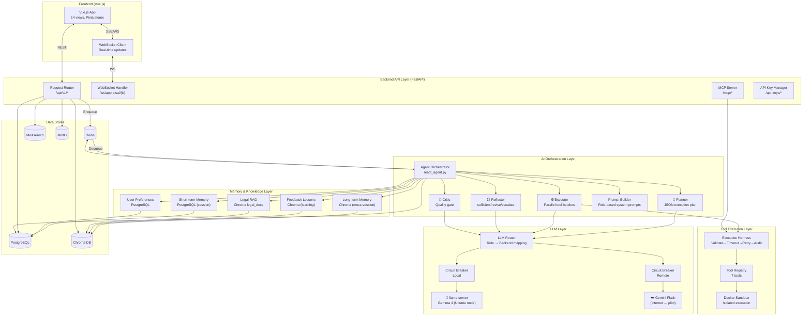

# HDTV AI System Diagram

> **Audience:** CTO
> **Mục đích:** Zoom vào HDTV AI Platform — internal components, data flows, và design decisions.

---

## Internal Architecture



---

## Component Responsibilities

| Component | Trách nhiệm | File |
|-----------|------------|------|
| **Agent Orchestrator** | Điều phối toàn bộ Agent loop, emit WS events | `orchestrator/react_agent.py` |
| **Planner** | Tạo execution plan dạng JSON có parallel_group | `orchestrator/planner.py` |
| **Executor** | Chạy tool batches song song, chain tool output | `orchestrator/executor.py` |
| **Reflector** | Đánh giá kết quả, quyết định revise/escalate | `orchestrator/reflector.py` |
| **Critic** | Quality gate cuối: approve/reject/suggest fixes | `orchestrator/critic.py` |
| **LLM Router** | Route role → backend, circuit breaker, key rotation | `services/llm_router.py` |
| **Execution Harness** | Validate input, timeout, retry, error taxonomy | `services/tools/base.py` |
| **MCP Server** | Standard protocol cho external AI agents | `routers/mcp.py` |
| **Prompt Builder** | Role-based system prompts (4 roles) | `orchestrator/prompt_builder.py` |

---

## Data Flow: Appraisal Request

```
1. POST /api/v1/dossiers/{id}/appraise
   └─ FastAPI: Create AppraisalRecord in PG
   └─ FastAPI: Enqueue task to Redis
   └─ FastAPI: Return 202 + WebSocket URL
                    ↓
2. Celery picks up task
   └─ Retrieve memories from Chroma (top-k relevant)
   └─ Retrieve feedback lessons from Chroma
   └─ Retrieve legal docs from Chroma (RAG)
   └─ Build system prompt (role-based)
                    ↓
3. Planner Agent → llama-server
   └─ Returns JSON plan: [{id, tool, parallel_group, depends_on}]
   └─ Save to agent_plans table
   └─ Emit WS: "plan_created"
                    ↓
4. Executor runs plan
   └─ Group tools by parallel_group
   └─ asyncio.gather for each parallel batch
   └─ Each tool: validate → timeout(30s) → retry(1x) → audit log
   └─ Chain: EcoOcrExtract.extracted_text → LegalGraphRAG.query
   └─ Emit WS: "tool_executing", "tool_result" per tool
                    ↓
5. Reflector Agent → llama-server
   └─ Returns: sufficient | revise | escalate
   └─ If revise: re-plan with revision instructions (max 2x)
   └─ If escalate: create AgentClarification, emit WS: "clarification_needed"
                    ↓
6. Critic Agent → Gemini Flash (or llama-server fallback)
   └─ Returns: {approved, issues, suggested_fixes}
   └─ Save critic_verdict to AppraisalResult
   └─ Emit WS: "critic_review"
                    ↓
7. Finalize
   └─ Save AppraisalResult to PG
   └─ Update agent memory in Chroma
   └─ Re-index Meilisearch
   └─ Emit WS: "appraisal_complete"
```

---

## WebSocket Events

| Event | Trigger | Payload |
|-------|---------|---------|
| `task_started` | Celery picks up task | `{dossier_id, task_id}` |
| `plan_created` | Planner returns plan | `{steps_count, parallel_groups}` |
| `plan_revised` | Reflector triggers revision | `{revision, reason}` |
| `tool_executing` | Before each tool call | `{tool_name, plan_step_id}` |
| `tool_result` | After each tool call | `{tool_name, status, execution_ms}` |
| `clarification_needed` | HITL trigger | `{question, options[]}` |
| `clarification_answered` | User answers | `{answer}` |
| `critic_review` | Critic returns verdict | `{approved, issues_count}` |
| `appraisal_complete` | Final result saved | `{risk_level, resolution_md}` |
| `escalation_required` | Agent can't decide | `{reason}` |
| `timeout` | Task exceeds max duration | `{duration_s}` |
