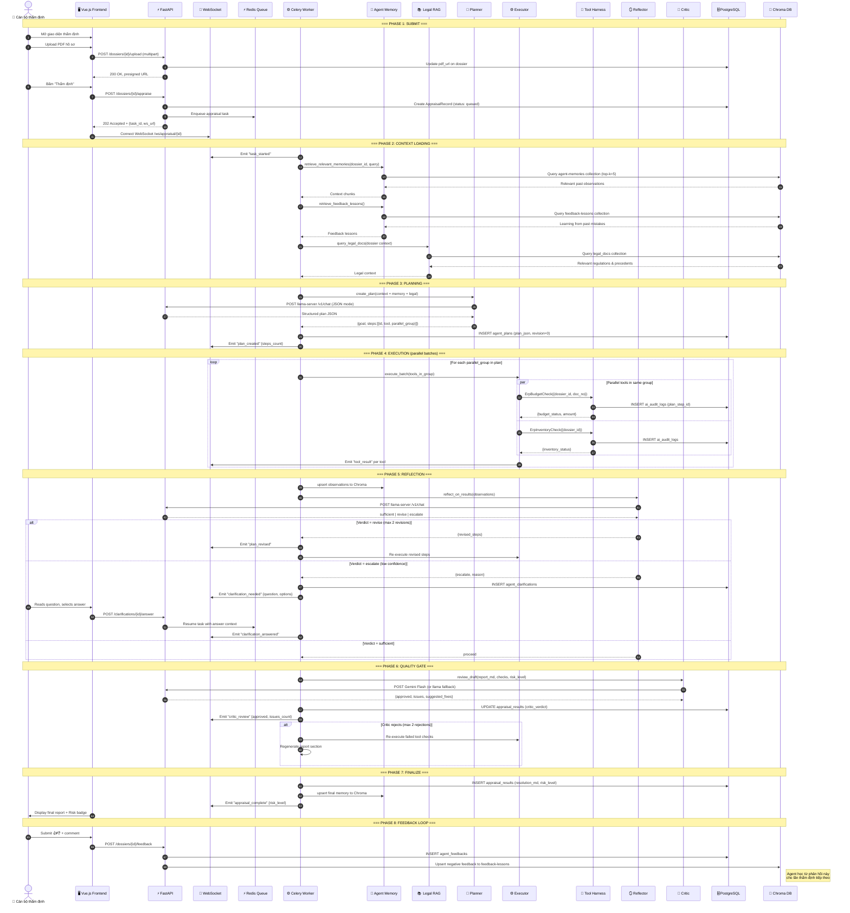

# End-to-End Flow — User đến Kết quả

> **Audience:** CTO, Solution Architect
> **Mục đích:** Full sequence diagram từ lúc user thao tác đến khi nhận kết quả thẩm định.

---

## Happy Path Sequence

---

## Error paths

| Tình huống | Behavior |
|-----------|----------|
| LLM timeout (>300s) | `asyncio.wait_for` → task timeout → status `needs_revision` + WS `timeout` |
| Tool TRANSIENT error | Retry 1x với 2s backoff → nếu vẫn fail → `error_type: transient` trong audit log |
| Tool BAD_INPUT | Không retry, return `{error_type: bad_input, hint}` → Planner revise |
| Chroma unreachable | Degraded mode: fallback sang full PG scan (không 500) |
| Meilisearch down | `_degraded: true` trong search response (không 500) |
| Circuit breaker OPEN | LLM Router fails-over: Gemini → local hoặc local → rule-based fallback |
| Max revisions reached | Skip to Critic với current draft |
| Max critic rejections | Accept draft with `approved: false` in verdict |
