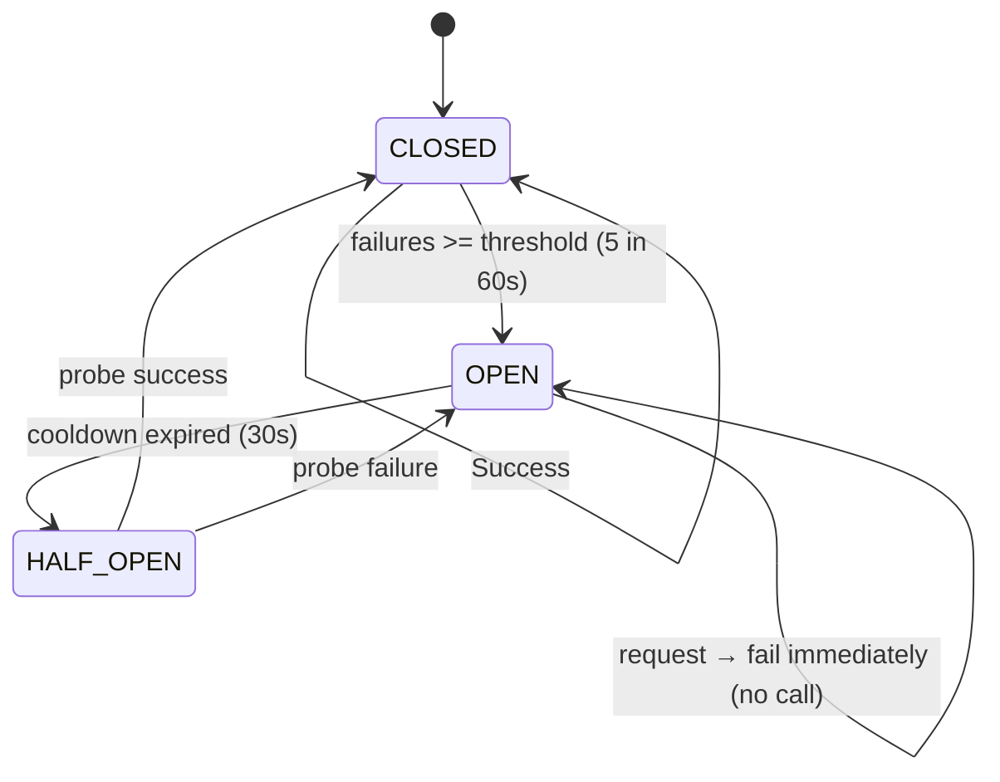
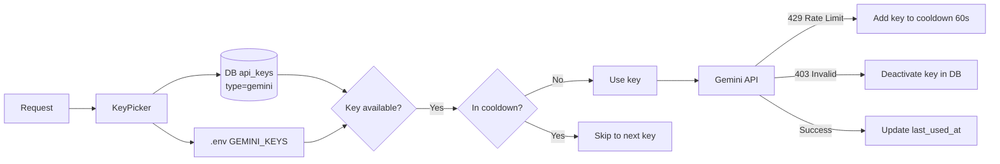

# LLM Router — Circuit Breaker, Key Rotation, Role Mapping

> **Audience:** CTO
> **Mục đích:** Giải thích thiết kế LLM Router — điểm quan trọng nhất để hệ thống resilient và swap-able.

---

## Design Decision: Tại sao cần LLM Router?

Nếu hardcode model trong từng agent:
```python
# BAD: hardcoded
async def plan(context):
    response = await gemini.generate(prompt)  # Nếu Gemini down → cả system down
```

Với LLM Router:
```python
# GOOD: swap-able
async def plan(context):
    response = await llm_router.call(role="PLANNER", messages=...)
    # Router tự quyết định backend, fallback, retry
```

**3 lợi ích:**
1. **Swap model** = đổi config, không sửa code
2. **Resilience** = circuit breaker tự fail-over
3. **Cost optimization** = heavy tasks → local, expensive domain tasks → remote

---

## Role → Backend Mapping

```python
ROLE_BACKEND_MAP = {
    # Local: low latency, no network dependency, planning tasks
    "PLANNER":   "local",   # JSON plan generation
    "EXECUTOR":  "local",   # ReAct step orchestration
    "REFLECTOR": "local",   # Observation analysis
    "SUMMARY":   "local",   # Report synthesis

    # Remote: domain knowledge, high accuracy (pilot only)
    "LEGAL":     "remote",  # Vietnamese legal expertise
    "FINANCIAL": "remote",  # ERP financial analysis
    "OCR":       "remote",  # Vision model for PDF scan
    "CRITIC":    "remote",  # Final quality review
    "TOOL_MOCK": "remote",  # Simulate ERP/DOffice responses
}
```

**Rationale:** Local model tốt cho reasoning/planning (task có structure). Remote model tốt cho domain knowledge (legal text, financial analysis) vì training data phong phú hơn.

---

## Circuit Breaker Architecture



```python
# circuit_breaker.py
class CircuitBreaker:
    def __init__(self, failure_threshold=5, cooldown_s=30):
        self.state = "CLOSED"           # CLOSED | OPEN | HALF_OPEN
        self.failure_count = 0
        self.failure_window = 60        # seconds
        self._lock = asyncio.Lock()

    async def call(self, fn, *args, **kwargs):
        async with self._lock:
            if self.state == "OPEN":
                if self._cooldown_expired():
                    self.state = "HALF_OPEN"
                else:
                    raise CircuitOpenError()  # Fail fast, no network call

        try:
            result = await fn(*args, **kwargs)
            await self._on_success()
            return result
        except Exception as e:
            await self._on_failure()
            raise
```

**Hai circuit breakers độc lập:**
- `_cb_local` cho llama-server (Ubuntu node)
- `_cb_remote` cho Gemini Flash API

**Fail-over logic:**
```
Local CB OPEN → fail-over sang Remote CB
Remote CB OPEN → rule-based fallback (không return error, return safe default)
Both OPEN → rule-based fallback
```

---

## Gemini Key Rotation với Cooldown



```python
# Cooldown tracker (in-memory)
_key_cooldown: dict[str, float] = {}   # key → cooldown_until timestamp

def _next_gemini_key() -> str:
    now = time.time()
    # DB keys first (managed, rotatable at runtime)
    db_keys = get_active_gemini_keys_from_db()
    all_keys = db_keys + settings.gemini_api_keys_env

    for key in all_keys:
        if _key_cooldown.get(key, 0) < now:  # Not in cooldown
            return key

    raise AllKeysExhaustedError()  # Circuit breaker will handle
```

**Design rationale:** DB keys cho phép thêm/xóa key tại runtime không cần redeploy. Cooldown 60s cho phép keys recover sau 429.

---

## Appraisal-level Timeout Guard

Ngoài per-tool timeout (30s), còn có absolute timeout cho toàn bộ task:

```python
# tasks.py
async def run_appraisal(dossier_id: int):
    try:
        await asyncio.wait_for(
            _do_appraisal(dossier_id),
            timeout=settings.appraisal_max_duration_s  # default: 300s
        )
    except asyncio.TimeoutError:
        await set_status(dossier_id, "needs_revision")
        await ws_emit(dossier_id, {"type": "timeout", "duration_s": 300})
```

**Rationale:** Agent có thể bị stuck trong revision loop. Absolute timeout là safety net cuối cùng đảm bảo task không tốn tài nguyên vô hạn.

---

## Metrics

```python
# metrics.py — Prometheus counters
LLM_CALLS = Counter("hdtv_llm_calls_total", ["backend", "role", "status"])
LLM_CIRCUIT_TRIPS = Counter("hdtv_llm_circuit_trips_total", ["backend", "role"])
APPRAISAL_TIMEOUTS = Counter("hdtv_appraisal_timeouts_total")
LLM_LATENCY = Histogram("hdtv_llm_latency_seconds", ["backend", "role"])
```

**Grafana alerts:**
- `HdtvLlmCircuitOpen`: Circuit breaker OPEN > 5 phút → cảnh báo Ops
- `HdtvAppraisalTimeout`: Timeout rate > 10% trong 5 phút → investigate
