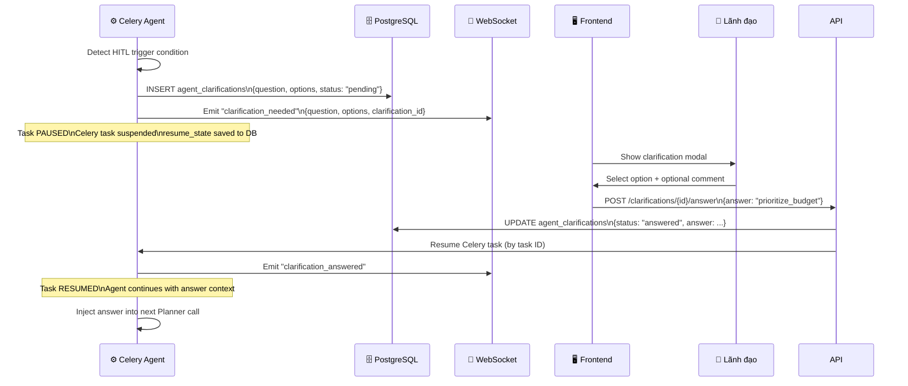

# Human-in-the-Loop (HITL)

> **Audience:** CTO, Product Manager
> **Mục đích:** Thiết kế HITL — khi nào AI pause, khi nào resume, và tại sao đây là tính năng quan trọng cho nghiệp vụ thẩm định.

---

## Tại sao cần HITL?

Thẩm định hồ sơ là nghiệp vụ có **high-stakes decisions**:
- Sai → phê duyệt dự án sai, thất thoát ngân sách
- Đúng quá bảo thủ → trì hoãn dự án cần thiết

AI không nên tự quyết định 100% khi có conflict hoặc low confidence. **HITL là safety net cho lãnh đạo.**

---

## HITL Trigger Conditions

```python
# react_agent.py — 2 triggers
HITL_TRIGGERS = [
    {
        "name": "tool_conflict",
        "condition": "ErpBudgetCheck FAIL and ErpInventoryCheck FAIL",
        "question": "Cả ngân sách và tồn kho đều có vấn đề. Ưu tiên xử lý vấn đề nào trước?",
        "options": [
            "prioritize_budget",     # Escalate lên phòng tài chính
            "prioritize_inventory",  # Escalate lên phòng vật tư
            "both_escalate"          # Escalate cả hai đồng thời
        ]
    },
    {
        "name": "low_confidence",
        "condition": "Reflector verdict = 'escalate' OR mixed fail/pass with unclear risk",
        "question": "Agent không chắc chắn về kết luận. Bạn muốn tiếp tục hay yêu cầu kiểm tra thêm?",
        "options": [
            "accept_and_continue",   # Chấp nhận kết quả hiện tại
            "request_more_checks"    # Yêu cầu agent kiểm tra thêm
        ]
    }
]
```

---

## HITL Flow



---

## State Persistence khi Pause

Khi agent pause chờ HITL, state được lưu vào DB để không mất khi Celery worker restart:

```python
# clarification_service.py
class AgentClarification(Base):
    __tablename__ = "agent_clarifications"
    id: int
    dossier_id: int
    task_id: str           # Celery task ID để resume
    question: str
    options: JSONB         # List of option strings
    status: str            # pending | answered | expired
    answer: str | None
    resume_state: JSONB    # Current observations snapshot
    created_at: datetime
    answered_at: datetime | None
```

```python
# react_agent.py — resume with answer context
async def resume_appraisal(clarification: AgentClarification):
    # Restore observations from saved state
    observations = clarification.resume_state["observations"]

    # Inject answer into context
    clarification_context = f"""
    [CLARIFICATION RESOLVED]
    Question: {clarification.question}
    User decision: {clarification.answer}
    Continue appraisal based on this decision.
    """

    # Re-run from Reflector step with enriched context
    await run_reflector(observations + [clarification_context])
```

---

## UX Design — Frontend

Khi `clarification_needed` event đến qua WebSocket:

```
┌─────────────────────────────────────────────────────────┐
│  ⚠️  Agent cần quyết định của bạn                        │
│                                                         │
│  Cả ngân sách và tồn kho đều có vấn đề.                 │
│  Ưu tiên xử lý vấn đề nào trước?                        │
│                                                         │
│  ○ Ưu tiên ngân sách (Escalate phòng tài chính)         │
│  ○ Ưu tiên tồn kho (Escalate phòng vật tư)             │
│  ● Escalate cả hai đồng thời                            │
│                                                         │
│  Ghi chú: ________________________________              │
│                                                         │
│  [  Xác nhận  ]                                        │
└─────────────────────────────────────────────────────────┘
```

- Progress bar **pause** khi có clarification
- Modal không thể dismiss (forced decision)
- Sau khi confirm → progress bar resume tự động

---

## Design Rationale

| Decision | Lý do |
|----------|-------|
| Max 2 HITL per appraisal | Quá nhiều lần hỏi → ảnh hưởng UX, mất niềm tin vào AI |
| State saved to DB | Celery worker có thể crash → task resume từ đúng điểm |
| Options thay vì free text | Lãnh đạo bận, cần quyết định nhanh, không gõ text |
| Pause toàn bộ task | Đảm bảo context consistency — không có tool nào chạy dở khi pending |
| WebSocket emit | Real-time → lãnh đạo thấy ngay, không cần refresh |

---

## Pending Clarifications API

```
GET /api/v1/clarifications/pending
→ Danh sách tất cả clarification đang chờ (admin view)

POST /api/v1/clarifications/{id}/answer
Body: {"answer": "prioritize_budget", "comment": "..."}
→ Resume task
```
