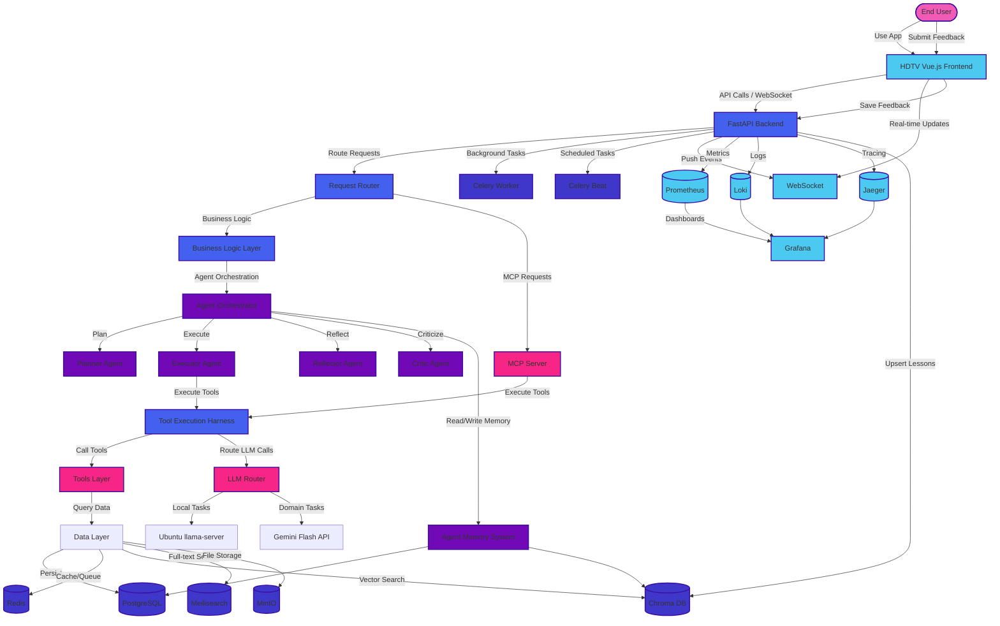
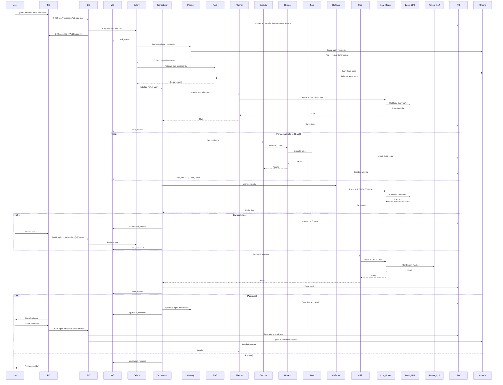
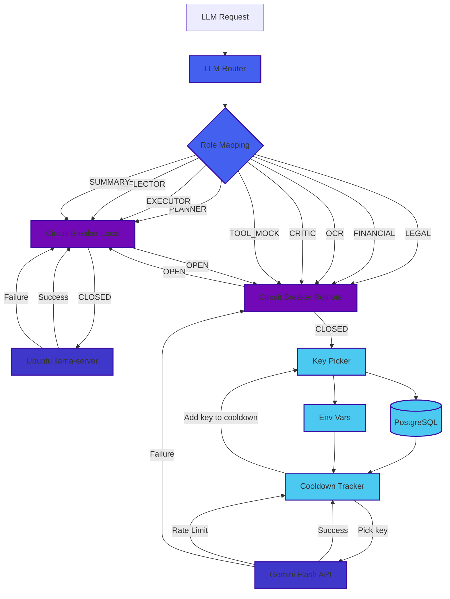
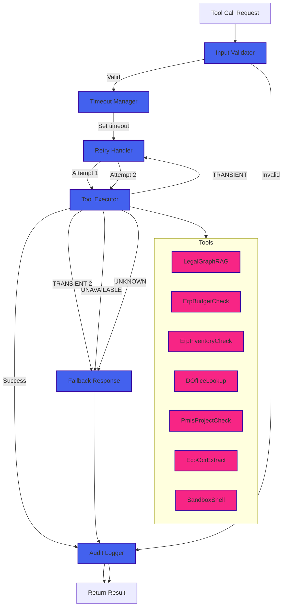
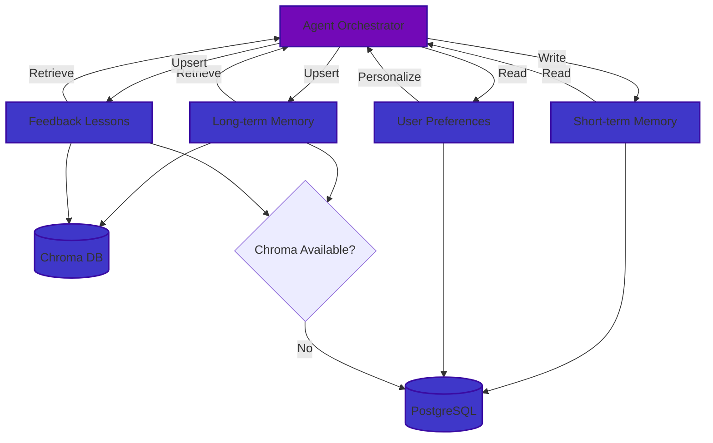
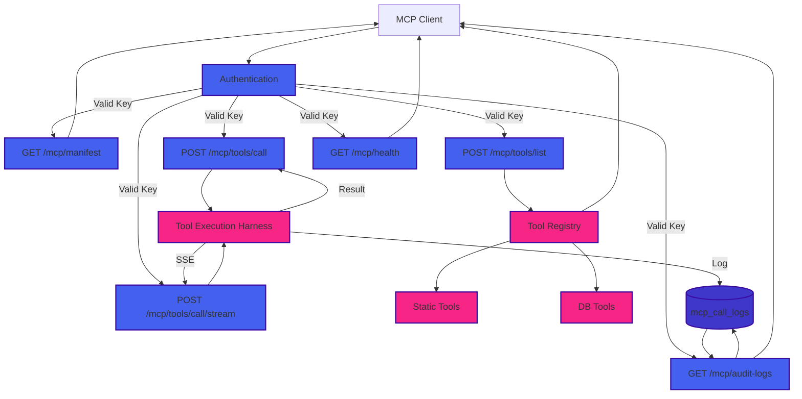

# Comprehensive HDTV AI Platform Architecture (System Software + Agentic AI)

---

## 1. Overall End-to-End Flow (FE → BE → MCP → LLM → Tools)

---

## 2. Detailed Agentic Orchestrator Flow (Plan → Execute → Reflect → Critic)

---

## 3. LLM Router Detailed Architecture (Key Rotation + Circuit Breakers)

---

## 4. Tool Execution Harness (Validation + Timeout + Retry + Audit)

---

## 5. Agent Memory System (Short-term + Long-term + Feedback)

---

## 6. MCP Server Architecture (Auth + Tools + Audit)

---

## 7. Key Design Principles (System Software + Agentic AI)

### System Software Principles
- Microservices-like Architecture: Separate concerns (API, workers, databases)
- Observability First: Metrics, logs, tracing (Prometheus, Loki, Jaeger, Grafana)
- Resilience: Circuit breakers, retries, fallbacks, degraded mode
- Security: API keys, hashing, Docker sandbox, rate limiting
- Performance: Virtual scrolling, parallel tool execution, caching

### Agentic AI Principles
- ReAct Loop: Plan → Execute → Reflect → Critic
- Memory Hierarchy: Short-term (session) + Long-term (cross-session) + Feedback learning
- Role-based Specialization: Different agents for different tasks
- Human-in-the-loop: Clarification requests when low confidence
- Tool Use: Structured tool calls with validation
- Self-correction: Critic reviews draft reports, suggests revisions

### Hybrid Strengths
- Best of Both Worlds: Combines software engineering best practices with modern agentic AI
- Cost Optimization: Local LLM for planning/execution, remote for domain knowledge
- Scalability: Async tasks, parallel execution, distributed workers
- Maintainability: Clear separation of concerns, audit logs, monitoring
