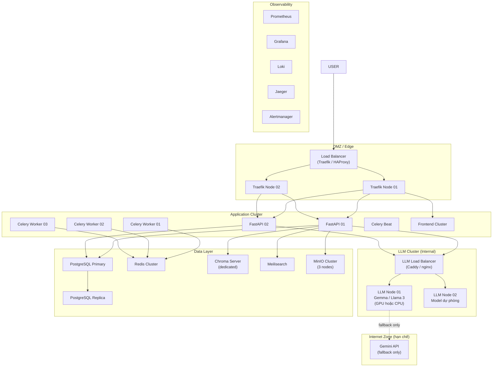

# Giai đoạn 2 — Medium Scale (2026–2027)

> **Audience:** CTO, Solution Architect, CEO
> **Mục đích:** Từ 1 client pilot → 3-5 clients, nhiều loại hồ sơ, bắt đầu tách LLM khỏi internet.

---

## 1. Mục tiêu giai đoạn

| Dimension | Giai đoạn 1 (Now) | Giai đoạn 2 (Target) |
|-----------|-------------------|---------------------|
| Clients | 1 (EVN/HDTV) | 3-5 clients (các đơn vị EVN khác, hoặc ngành khác) |
| Dossier types | 3 loại | 10+ loại (xây dựng, mua sắm, hợp đồng, kiểm toán...) |
| Users/ngày | ~10 | ~50-200 |
| Dossier/ngày | ~50 | ~200-500 |
| LLM dependency | Gemini API (internet) | Hybrid: local ưu tiên, Gemini fallback giới hạn |
| Tool integration | Mock APIs | Real ERP/DOffice/PMIS connectors |
| Infrastructure | 2 nodes | 5-10 nodes |

---

## 2. Kiến trúc Medium Scale



---

## 3. Những thay đổi chính so với Giai đoạn 1

### 3.1 LLM Layer — Chuyển sang Hybrid, ưu tiên nội bộ

**Vấn đề cần giải quyết:** Gemini API phụ thuộc internet, có cost, có latency.

**Giải pháp:**
- Deploy thêm **LLM Node 02** với model mạnh hơn (Llama 3.1 70B hoặc Qwen 2.5 72B)
- LLM Router đổi policy: **local first, Gemini chỉ dùng khi local unavailable**
- Gemini chỉ còn được phép gọi cho: `OCR` (vì cần vision model), không còn cho `LEGAL`, `FINANCIAL`, `CRITIC`

```python
# llm_router.py — Medium Scale policy
ROLE_BACKEND_MAP = {
    "PLANNER":   "local",   # Gemma/Llama nội bộ
    "EXECUTOR":  "local",   # Gemma/Llama nội bộ
    "REFLECTOR": "local",   # Gemma/Llama nội bộ
    "CRITIC":    "local",   # Model lớn hơn nội bộ  ← THAY ĐỔI
    "LEGAL":     "local",   # Fine-tuned legal model ← THAY ĐỔI
    "FINANCIAL": "local",   # Fine-tuned finance model ← THAY ĐỔI
    "SUMMARY":   "local",
    "OCR":       "remote",  # Vẫn dùng Gemini vision (chưa có local vision model tốt)
    "TOOL_MOCK": "local",
}
```

### 3.2 Multi-tenant Support

Mỗi client (EVN Miền Nam, EVN Miền Bắc, hay client ngành khác) có:
- Schema PostgreSQL riêng hoặc database riêng
- Chroma collection riêng (legal docs theo ngành/địa phương)
- API Key riêng, rate limit riêng
- Dashboard Grafana riêng

```
hdtv_evn_south/          ← schema cho EVN Miền Nam
hdtv_evn_north/          ← schema cho EVN Miền Bắc
hdtv_client_xyz/         ← schema cho client mới
```

### 3.3 Real Tool Integration

Thay mock APIs bằng connector thật:

| Tool | Hiện tại | Giai đoạn 2 |
|------|----------|------------|
| `ErpBudgetCheck` | Gemini mock | REST/SOAP connector → SAP/Oracle ERP thật |
| `DOfficeLookup` | Gemini mock | API connector → DOffice thật |
| `PmisProjectCheck` | Gemini mock | API connector → PMIS thật |
| `EcoOcrExtract` | Gemini vision | Local vision model hoặc Gemini (giới hạn) |

Kiến trúc connector:
```
Tool Execution Harness
        ↓
Tool Connector Layer (MỚI)
  ├── ErpConnector (HTTP → SAP API)
  ├── DOfficeConnector (HTTP → DOffice API)
  ├── PmisConnector (HTTP → PMIS API)
  └── OcrConnector (local vision model / Gemini fallback)
```

### 3.4 Worker Scale-out

```yaml
# docker-compose: scale workers theo load
services:
  hdtv-worker:
    deploy:
      replicas: 3           # Từ 1 → 3 worker
    environment:
      CELERY_CONCURRENCY: 4 # 4 concurrent tasks per worker
```

Tổng throughput: **12 concurrent appraisals** (3 workers × 4 concurrency).

### 3.5 PostgreSQL HA

- Primary + Read Replica
- Read replica cho queries báo cáo/analytics
- Backup automated (đã có `T-35: backup.sh`, mở rộng thêm off-site backup)

---

## 4. Loại hồ sơ mở rộng

Nghiệp vụ thẩm định có thể mở rộng sang:

| Loại hồ sơ mới | Tools cần thêm | Legal docs cần ingest |
|----------------|---------------|----------------------|
| Hợp đồng xây dựng | BuildingPermitCheck, ConstructionLegalRAG | Luật Xây dựng, Nghị định 15/2021 |
| Kiểm toán nội bộ | AuditTrailCheck, FinancialRatioCalc | Chuẩn mực kiểm toán VN |
| Mua sắm tập trung | CentralProcurementCheck | Luật Đấu thầu 22/2023 |
| Hợp đồng lao động | LaborLawCheck, InsuranceCheck | Bộ Luật Lao động |

**Cách thêm loại hồ sơ mới:**
1. Thêm tool vào `STATIC_TOOL_IMPLS` — không đụng agent core
2. Ingest legal docs mới vào Chroma collection tương ứng
3. Tạo role-based prompt profile mới cho loại hồ sơ đó

---

## 5. Infrastructure estimate

| Component | Giai đoạn 1 | Giai đoạn 2 |
|-----------|------------|------------|
| LLM Nodes | 1 × Ubuntu (8GB RAM) | 2 × Server (32GB RAM, GPU optional) |
| App Nodes | 1 × Alpine (6GB RAM) | 3 × Server (16GB RAM each) |
| DB Nodes | Embedded | 2 × DB Server (32GB RAM) |
| Storage | Local volumes | MinIO 3-node cluster (TB range) |
| Total RAM | ~14GB | ~150-200GB |
| Estimated cost | Dev hardware | ~5-10 server nodes (on-prem hoặc private cloud) |
