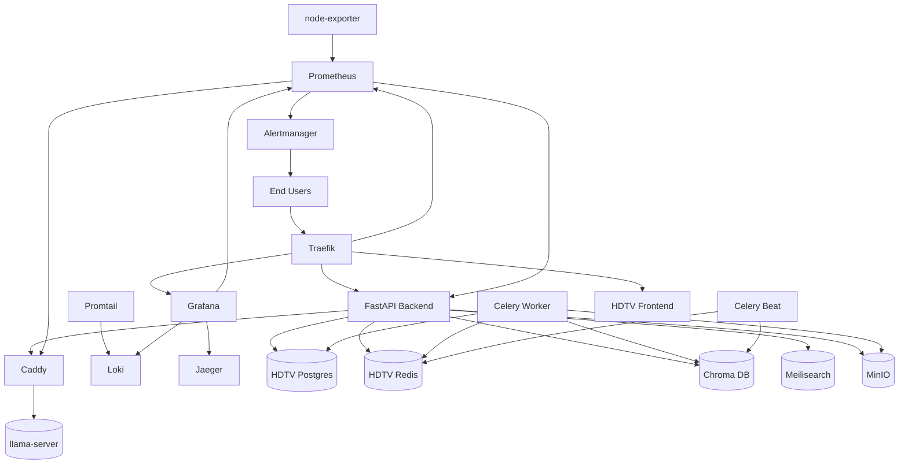
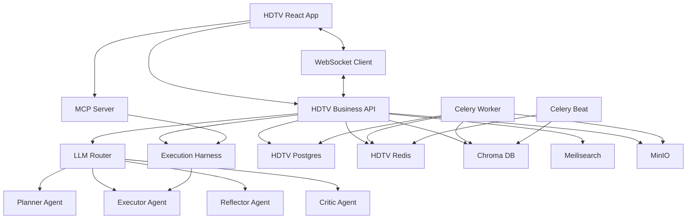
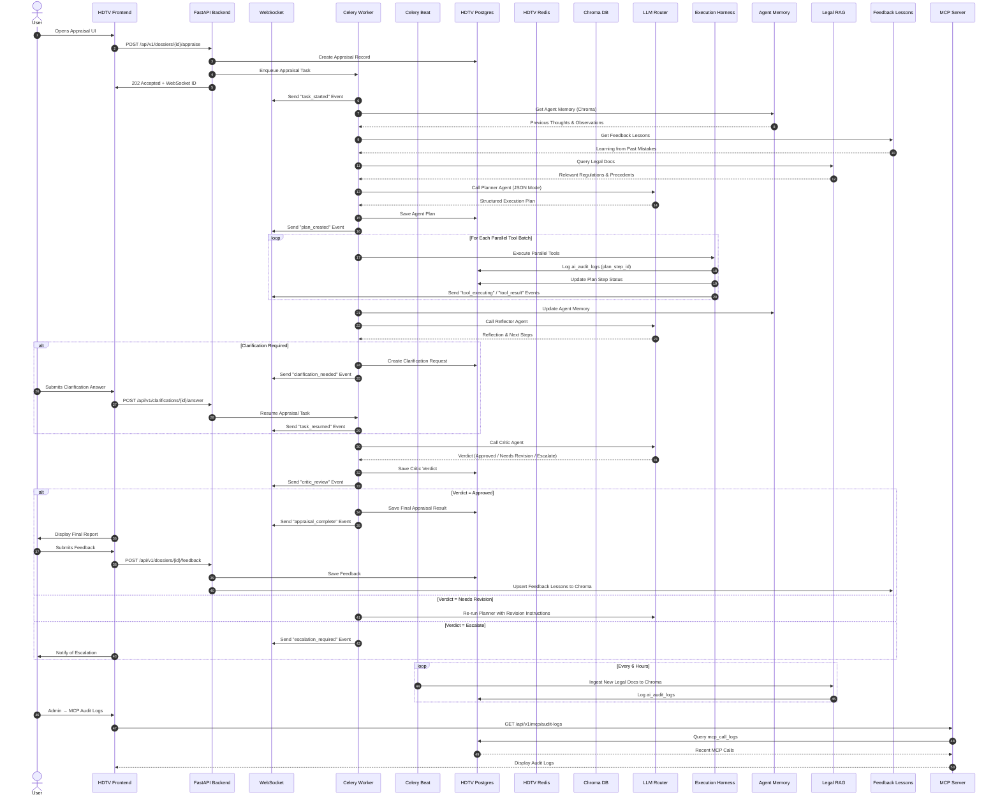

# System Design: HDTV AI Platform

---

## 1. Overall Nano Platform Architecture

---

## 2. Detailed HDTV AI System Design

### 2.1 Key HDTV AI Components
| Component | Purpose | Details |
|-----------|---------|---------|
| **LLM Router** | Routes calls to right LLM backend | - Ubuntu llama-server (Gemma 4) → Planner/Executor/Reflector - Gemini Flash → Legal/Financial/Critic/Tool Mock - Circuit Breaker (Open/Closed/Half-Open) - Gemini API Key Rotation + Cooldown |
| **Execution Harness** | Validates, runs, and retries tools | - Input Validation (required fields + types) - Per-tool Timeout (30s) - Retry TRANSIENT Errors (1x, 2s backoff) - Error Taxonomy (TRANSIENT/BAD_INPUT/UNAVAILABLE/UNKNOWN) - DB-configured Fallback Responses |
| **MCP Server** | Exposes tools to external AI agents | - GET /mcp/manifest - POST /mcp/tools/list - POST /mcp/tools/call (sync) - POST /mcp/tools/call/stream (SSE) - GET /mcp/audit-logs - GET /mcp/health - X-MCP-API-Key Auth (DB + .env fallback) |
| **Agentic Agents** | Plan, execute, reflect, criticize | 1. Planner → Creates execution plan 2. Executor → Runs parallel/chained tools 3. Reflector → Analyzes observations 4. Critic → Validates final report |
| **Audit Logs** | Tracks everything | - ai_audit_logs: tool calls with plan_step_id + error_type - mcp_call_logs: MCP server calls with api_key_id |

---

## 3. HDTV AI Full Workflow

---

## Topology Constraints (Strictly Followed)
✅ **2-Node Setup**:
1. Ubuntu Node → ONLY LLM (Gemma 4) + Caddy + node-exporter + Promtail
2. Alpine VM → Everything else

✅ **LLM Over HTTP Only**: No embedded LLM

✅ **HDTV Has Dedicated Resources**: Own Postgres, Redis, Chroma, Meilisearch, MinIO

✅ **All Tool Calls Audited**: Every tool call logged with `plan_step_id` and `error_type`
