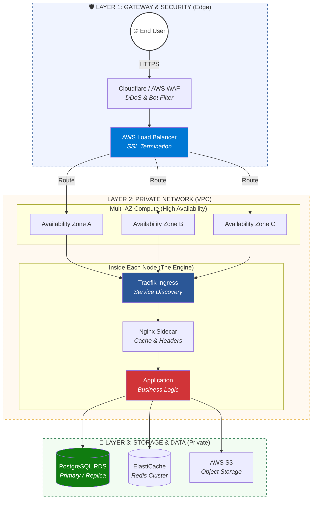

# Future Production Architecture Roadmap 🚀

This document outlines the evolution of the **Nano DevOps Platform** from a resource-constrained single-node setup to a high-availability, production-grade cloud infrastructure.

## 🏗 Current vs. Future Comparison

| Feature | Nano Platform (Current) | Production-Grade (Future) |
| :--- | :--- | :--- |
| **Compute** | Single-Node Alpine VM | Multi-AZ Node Clusters (EKS/K8s) |
| **Network** | Single Docker Network | Multi-Layer VPC (Public/Private/Data Subnets) |
| **Edge** | Traefik on Docker Host | WAF/CDN + Global Load Balancer (ALB) |
| **Database** | Local Container (Postgres 16) | Managed Multi-AZ RDS (Primary/Replica) |
| **Caching** | Local Redis Container | Managed Redis Cluster (ElastiCache) |
| **Security** | Docker Socket Proxy | VPC Isolation, Security Groups, IAM Roles |

## 🌐 Production Architecture Diagram

## 🛠 Strategic Logic for Productionization

### 1. Edge & Security Layer
- **WAF/CDN (Cloudflare/AWS WAF):** Implements DDoS protection and bot filtering at the edge, before traffic even reaches the VPC.
- **Global Load Balancer:** Handles SSL termination and host-based routing, distributing traffic across multiple Availability Zones (AZ).

### 2. Networking (VPC Design)
- **Isolation:** Moving from a shared Docker network to a three-tier VPC architecture ensures that application logic and data layers are never directly exposed to the internet.
- **NAT Gateway:** Allows private instances to fetch updates without having a public IP.

### 3. High Availability (Multi-AZ)
- **Compute:** Distributing Traefik and Application nodes across AZ-A, AZ-B, and AZ-C ensures zero downtime if a physical data center fails.
- **Data:** Moving from a single Postgres container to a Primary/Replica setup on managed services (like AWS RDS) provides automated failover and backup.

### 4. Application Delivery
- **Nginx Sidecar:** Introduced alongside app containers for specialized caching, compression, or security headers before reaching the app.
- **Internal Load Balancing:** Utilizing overlay networks (like K8s Service CIDR) for seamless service discovery.

---
*Note: This roadmap preserves the **Efficiency by Design** philosophy but scales it for enterprise-level reliability.*
