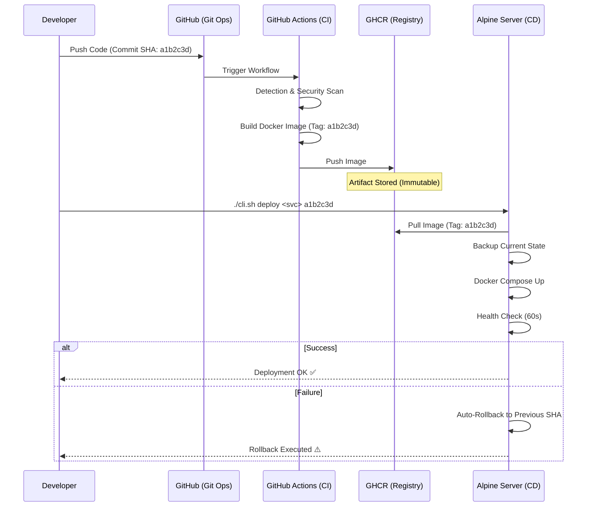

# 🏛️ Nano Platform: CI/CD Architectural Blueprint & Operations

Tài liệu này xác lập các tiêu chuẩn kỹ thuật và quy trình vận hành luồng CI/CD của Nano Platform. Mục tiêu cốt lõi: **Tự động hóa tuyệt đối, Bảo mật đa tầng, và Khả năng phục hồi tức thì.**

---

## **1. Chiến lược CI (Continuous Integration): Quality Enforcement**

Hệ thống CI không chỉ là công cụ build, mà là bộ quy tắc (Enforcement) đảm bảo mọi dòng code đi vào Production đều đạt chuẩn Enterprise.

### **Kiến trúc Kỹ thuật:**
- **Trunk-Based & Small Batches**: Khuyến khích commit nhỏ, push thường xuyên để giảm thiểu xung đột.
- **Intelligence Filtering**: Tối ưu hóa tài nguyên bằng cách chỉ build những gì thực sự thay đổi (Change-set detection).
- **Security-First Pipeline**:
    - **Zero-Secret Policy**: Chặn đứng rò rỉ thông tin qua Gitleaks (Hard-fail).
    - **Infrastructure as Code (IaC) Linting**: Kiểm soát chất lượng Dockerfile qua Hadolint.
    - **Static Analysis (SAST)**: Quét lỗ hổng bảo mật tự động bằng Semgrep.
- **Immutable Artifacts**: Đóng gói thành Docker Image gắn mã **Commit SHA** duy nhất. Quét lỗ hổng image (Trivy) trước khi lưu kho tại **GHCR**.

---

## **2. Chiến lược CD (Continuous Deployment): Resiliency & Trust**

CD tập trung vào việc duy trì tính ổn định của hệ thống thực tế thông qua các cơ chế kiểm soát rủi ro.

### **Nguyên tắc vận hành:**
- **Immutable Runtime**: Không bao giờ sửa lỗi trực tiếp trên Server. Mọi thay đổi phải đi từ Git -> CI -> Registry.
- **Deployment State Tracking**: Hệ thống luôn biết phiên bản nào đang chạy và phiên bản ổn định gần nhất là gì.
- **Active Health Validation**: Trạng thái "Running" của container không có ý nghĩa nếu API không phản hồi. Hệ thống bắt buộc phải kiểm tra `healthy status` thực tế.
- **Instant Rollback (Self-healing)**: Một quy trình CD được coi là lỗi nếu không thể tự quay về trạng thái ổn định cũ khi phát hiện lỗi mới. MTTR (Mean Time To Recovery) phải được tối ưu hóa ở mức < 60 giây.

---

## **3. Visual Workflow: The CI/CD Pipeline**



---

## **4. Ghost AI: Tương lai của Vận hành tự hành**

Nano Platform tích hợp khả năng **AIOps** thực thụ:
- **Detection**: Sensor (Go) phát hiện sự cố với chi phí tài nguyên cực thấp.
- **Reasoning**: **Gemini 2.5 Flash** phân tích logs và tìm ra nguyên nhân gốc rễ (RCA).
- **Action**: AI tự động viết Patch, chạy Verification trong Sandbox cô lập và gửi PR. 
> *Triết lý: Con người chỉ đóng vai trò phê duyệt (Approver), AI đóng vai trò thực thi (Executor).*

---

## **5. Hướng dẫn thực hành Step-by-Step (Demo với faulty-service)**

### **Bước 1: Kích hoạt luồng CI (V4.0 Update)**
1. Thực hiện thay đổi mã nguồn trong `faulty-service` (ví dụ: cập nhật log version tại `project_devops/apps/faulty-service/server.js`).
2. Thực hiện Commit & Push lên GitHub:
   ```bash
   git add .
   git commit -m "feat: upgrade faulty-service to V4.0"
   git push origin main
   ```
3. Truy cập tab **Actions** trên GitHub, theo dõi cho đến khi pipeline báo xanh tại job **Build & Publish**. Copy 7 ký tự đầu của **Commit SHA** (ID bản build).

### **Bước 2: Thực thi luồng CD trên VM**
1. Truy cập vào server điều khiển: `vagrant ssh`.
2. Sử dụng mã SHA vừa lấy để triển khai dịch vụ:
   ```bash
   # Cú pháp: ./cli.sh deploy <service_name> <tag/sha>
   ./cli.sh deploy faulty-service a1b2c3d
   ```
3. Hệ thống sẽ tự động thực hiện: **Pull (từ GHCR) -> Deploy -> Health Check**.

### **Bước 3: Xác thực & Giám sát**
1. Kiểm tra trạng thái runtime: `docker ps`.
2. Gọi API để kích hoạt log mới:
   ```bash
   curl http://localhost:8080/status
   ```
3. Kiểm tra logs container để xác nhận phiên bản V4.0:
   ```bash
   docker logs platform-faulty-service
   ```
   *Kết quả mong đợi: `🚀 [CI/CD V4.0] Demo: End-to-End flow with faulty-service is complete`*

---
**Nano DevOps Platform - Engineering Excellence through Efficiency and Intelligence.**