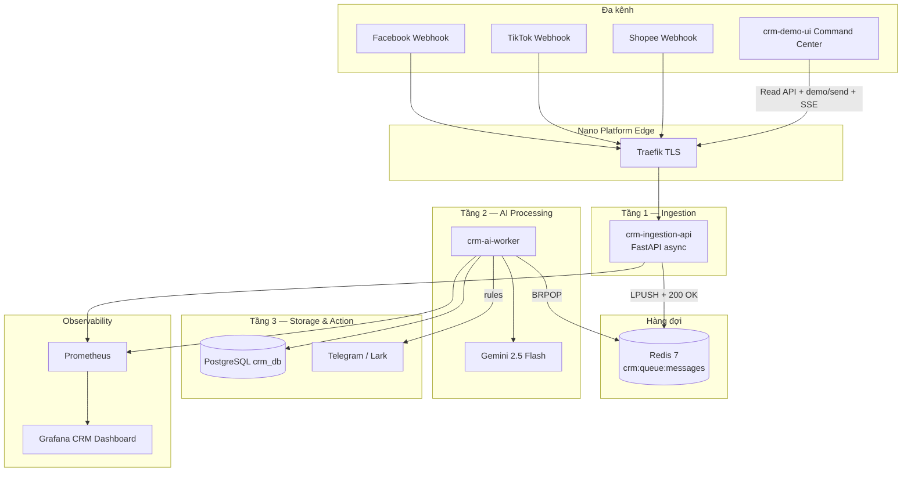

# Architecture — AI-Driven CRM Integration Pipeline

**Version**: 1.0 (Task 3.1)  
**Status**: Design authority — implementation MUST match this document.

---

## 1. Business narrative (phỏng vấn TNT Group)

**Pain:** Ads lớn tại Philippines, Indonesia… → hàng ngàn tin nhắn/lead đa ngôn ngữ, slang → CSKH nhập tay, server nghẽn khi gọi LLM đồng bộ.

**Solution:** Webhook cực nhẹ trả `200` ngay → hàng đợi Redis → worker gọi Gemini chuẩn hóa JSON → Postgres (CRM) → alert Leader nếu khẩn / sentiment xấu.

**Wow:** Khách muốn hủy đơn / chửi → Telegram/Lark trong vài giây.

---

## 2. High-level diagram

---

## 3. Three layers (technical)

### Layer 1 — Ingestion (zero-blocking)

| Thuộc tính | Quyết định |
|------------|------------|
| Runtime | FastAPI + uvicorn, async handlers |
| SLA ingest | p95 < 50ms (không gọi LLM) |
| Hành vi | Validate tối thiểu → serialize job JSON → `LPUSH` Redis → `200 {"status":"accepted"}` |
| Health | `GET /health`, `GET /metrics` (Prometheus) |

### Layer 2 — AI processing (background)

| Thuộc tính | Quyết định |
|------------|------------|
| Runtime | Python asyncio loop, blocking pop Redis |
| LLM | Gemini `generateContent` JSON mode |
| Prompt | Trích: `customer_name`, `phone`, `product_interest`, `urgency`, `sentiment`, `intent`, `language`, `summary` |
| Retry | 3 lần exponential backoff; sau đó `crm:queue:dlq` |

### Layer 3 — Storage & action

| Thuộc tính | Quyết định |
|------------|------------|
| CRM store | Postgres `crm_db.leads`, `crm_db.processing_log` |
| Alerts | Xem [ALERT_RULES.md](./docs/ALERT_RULES.md) |
| Idempotency | `message_id` unique — duplicate webhook → skip AI, vẫn 200 |

---

## 4. Services & resource budget (6GB platform)

| Service | Container name | Memory limit | Public URL |
|---------|----------------|--------------|------------|
| crm-ingestion-api | platform-crm-ingestion | **120M** | `crm-ingest.nano.platform` |
| crm-ai-worker | platform-crm-worker | **280M** | Không expose Traefik |

**Tổng thêm ~400M** — nằm trong budget sau khi Odoo tắt (hiện comment trong compose).

**Phụ thuộc:**
- `platform-redis` (healthy)
- `platform-postgres` (healthy)
- Secret: `gemini_api_key`, `telegram_bot_token`, `telegram_chat_id` (optional Lark)

---

## 5. Platform integration map

| Concern | Location | Task |
|---------|----------|------|
| Compose | `project_devops/platform/composition/docker-compose.apps.yml` | 3.6 |
| Postgres init | `project_devops/platform/config/postgres/init/04-crm-init.sh` | 3.4 |
| CI build | `.github/workflows/ci.yml` paths `ai-crm-pipeline/crm-ingestion-api/**`, `crm-ai-worker/**` | 3.7 |
| Smoke | `project_devops/platform/ops/smoke-tests/smoke-test-crm-ingestion.sh` | 3.9 |
| Grafana | `project_devops/platform/monitoring/grafana/dashboards/crm-pipeline.json` | 3.8 |

**Traefik labels (ingestion):** copy pattern từ `health-api` — `traefik.enable=true`, host rule, prometheus labels.

---

## 6. Security

- Webhook optional `X-Webhook-Secret` header vs env `CRM_WEBHOOK_SECRET`.
- Gemini key: Docker secret file, không commit.
- Worker không có route public — chỉ `platform-network`.
- PII (SĐT) trong Postgres — demo lab only; production cần retention policy (ghi chú runbook).

---

## 7. Observability metrics (bắt buộc implement)

| Metric | Service | Ý nghĩa |
|--------|---------|---------|
| `crm_ingest_requests_total` | ingestion | Webhook count by channel |
| `crm_ingest_enqueue_duration_seconds` | ingestion | Enqueue latency |
| `crm_queue_depth` | worker (gauge) | `LLEN` Redis |
| `crm_worker_jobs_processed_total` | worker | success/fail label |
| `crm_llm_latency_seconds` | worker | Gemini round-trip |
| `crm_alerts_sent_total` | worker | by `alert_type` |
| `crm_auto_reply_total` | worker | sent / skipped / error (Phase 4) |

**Grafana Phase 4:** panel *Leads by channel* = `crm_ingest_requests_total{status="accepted"}` by `channel`.

---

## 8. Phase 4 — Command Center (summary)

| Component | Role |
|-----------|------|
| `crm-demo-ui` | React SPA — channel buttons, SSE stream, ROI widget |
| `/api/v1/*` | Read API + `POST /demo/send` (CORS demo origin) |
| Redis `crm:events:leads` | Pub/sub → SSE `/api/v1/events/stream` |
| `auto_reply.py` | Gemini reply for inquiry/purchase; skip critical |
| `crm-demo-simulator` | CLI load test |

See [docs/DEMO_PLATFORM_PLAN.md](./docs/DEMO_PLATFORM_PLAN.md).

---

## 9. Phase 3 task alignment

| MASTER_PLAN | Deliverable |
|-------------|-------------|
| 3.1 | This doc + `docs/*` ✅ |
| 3.2 | `crm-ingestion-api/` |
| 3.3 | `crm-ai-worker/` + Gemini client |
| 3.4 | SQL init + DATA_MODEL |
| 3.5 | Alert module per ALERT_RULES |
| 3.6–3.10 | IMPLEMENTATION_CHECKLIST |

---

## 10. Failure modes

| Scenario | Hành vi |
|----------|---------|
| Redis down | Ingestion `503` — không fake 200 (platform alert) |
| Gemini timeout | Retry → DLQ → metric `fail` |
| Postgres down | Worker backoff; ingestion vẫn queue (bounded — max 10k, drop oldest policy Task 3.3) |
| Alert API fail | Log + metric; lead vẫn lưu DB |

---

*Mọi thay đổi kiến trúc phải sửa file này trước khi code.*
