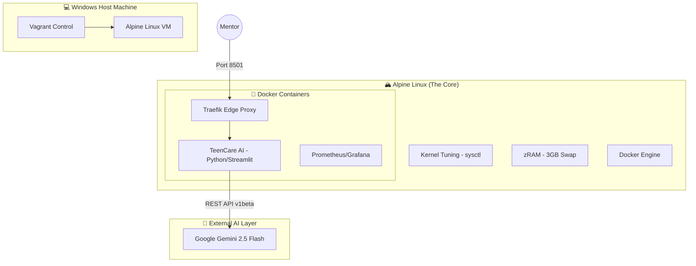
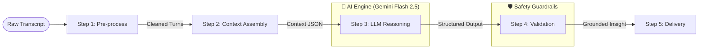

# TeenCare Parent Copilot — Presentation 🚀

Tài liệu này cung cấp cái nhìn tổng quan về kiến trúc, luồng nghiệp vụ và mục tiêu của dự án **TeenCare AI (Parent Copilot)**, phục vụ cho việc giới thiệu và trình diễn hệ thống.

---

## 1. Mục tiêu Dự án (Objectives)

Dự án ra đời nhằm giải quyết khoảng cách thông tin giữa **Mentor - Học sinh - Phụ huynh** sau mỗi buổi học 1-on-1.

- **Insight Tin cậy (Grounded)**: Mọi nhận xét về học sinh đều phải có bằng chứng (quote) trực tiếp từ buổi học. Không "bịa" (hallucination).
- **Hành động cụ thể (Actionable)**: Cung cấp cho phụ huynh "Cần làm gì", "Khi nào" và "Kỳ vọng gì" thay vì lời khuyên chung chung.
- **Tốc độ (Speed)**: Tự động hóa quá trình tạo báo cáo trong **< 5 phút** sau khi kết thúc session.
- **Hiệu quả (Efficiency)**: Vận hành trên hạ tầng tối giản (6GB RAM) nhưng vẫn đảm bảo độ tin cậy của AI cấp độ Senior.

---

## 2. Tech Stack Toàn Hệ Thống (System Architecture)

Hệ thống được xây dựng trên nền tảng **Nano DevOps**, tối ưu hóa từng MB RAM bằng cách sử dụng Alpine Linux và Docker.

---

## 3. Luồng Hoạt động TeenCare AI (Operational Flow)

TeenCare AI vận hành theo mô hình **5-Step Pipeline** nghiêm ngặt để đảm bảo an toàn dữ liệu.

---

## 4. Chi tiết Nghiệp vụ (Business Logic)

### **A. Đầu vào (Input)**
Hệ thống tiếp nhận dữ liệu qua giao diện Dashboard hoặc file JSON:
- **Raw Transcript**: Nội dung thô của buổi học (có thể là file `.txt`).
- **Teen Profile**: Thông tin cơ bản về tính cách và lịch sử của học sinh.
- **Family Goals**: Những mục tiêu mà phụ huynh đang quan tâm (ví dụ: "giảm sử dụng điện thoại").

### **B. Cách xử lý (Processing)**
1.  **Diarization (Step 1)**: Phân định ai là người nói (Mentor hay Học sinh) dựa trên quy luật ngôn ngữ và AI Classifier.
2.  **Context Assembly (Step 2)**: Kết hợp thông tin buổi học hiện tại với lịch sử và mục tiêu gia đình để tạo "siêu ngữ cảnh" cho AI.
3.  **LLM Call (Step 3)**: Sử dụng **Gemini 2.5 Flash** (gọi REST API trực tiếp) để suy luận ra các insight.
4.  **Validation (Step 4)**: Kiểm tra chéo xem các insight AI đưa ra có thực sự dựa trên câu nói nào trong transcript không. Nếu không có bằng chứng, insight đó sẽ bị loại bỏ.

### **C. Đầu ra (Output)**
Kết quả trả về cho phụ huynh (và mentor xem trước):
- **Insights**: Các thấu hiểu sâu sắc (ví dụ: "Con đang cảm thấy áp lực vì kỳ thi sắp tới").
- **Evidence**: Câu trích dẫn trực tiếp của con (ví dụ: "Con thấy mệt mấy ngày nay").
- **Action Plan**: Hành động cụ thể (ví dụ: "Tối nay hãy hỏi con về môn Toán, chỉ lắng nghe, không phán xét").
- **Risk Level**: Cảnh báo rủi ro tâm lý (Low/Medium/High).

---
*Tài liệu này được biên soạn để phục vụ việc demo và vận hành trên hệ thống Nano DevOps.*
